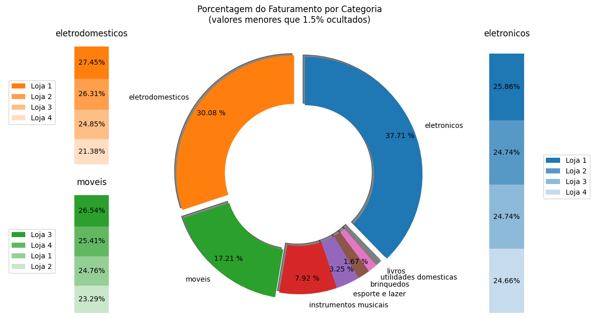
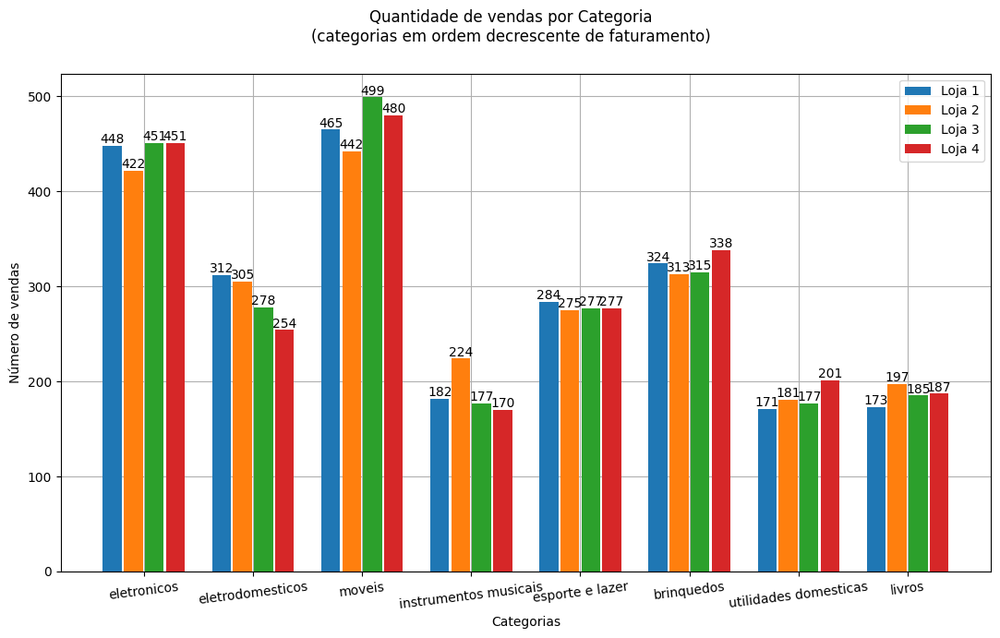
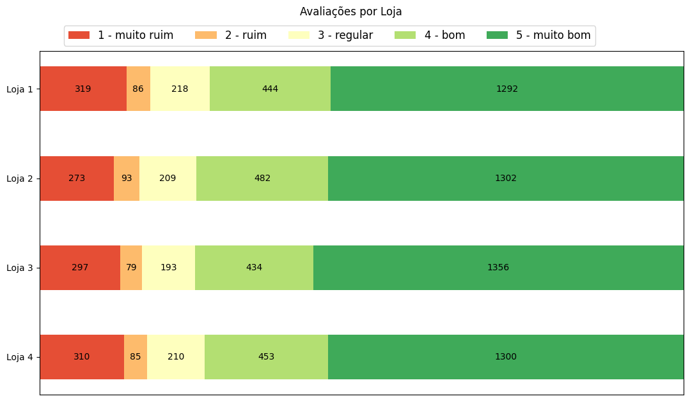
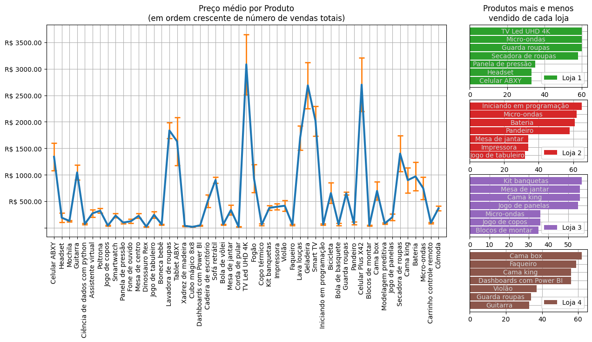

# Alura+ONE Challenge 2

Challenge Based Learning.

[Parte da formação Oracle Next Education](https://www.oracle.com/br/education/oracle-next-education/) + [Alura](https://www.alura.com.br/).

---

## Alura Store

Durante este desafio, você irá ajudar o Senhor João a decidir qual loja da sua rede Alura Store vender para iniciar um novo empreendimento.

Para isso, você analisará dados de vendas, desempenho e avaliações das 4 lojas fictícias da Alura Store. O objetivo é identificar a loja com menor eficiência e apresentar uma recomendação final baseada nos dados.

[Repositório Base - Alura Store](https://github.com/alura-es-cursos/challenge1-data-science/tree/main).

---

## Requisitos

- [x] Analisar os dados das lojas. Avaliar informações como:
    - [x] faturamento total de cada loja,
    - [x] categorias mais populares (mais vendidas),
    - [x] média de avaliações dos clientes,
    - [x] produtos mais e menos vendidos,
    - [x] custo médio do frete.
- [x] Criar gráficos para visualização:
    - [x] Decidir quais tipos de gráficos usar para apresentar os resultados de maneira clara e visual.
    - [x] **Mínimo de 3 gráficos diferentes**, que podem incluir gráficos de barras, pizza, dispersão, entre outros.
- [x] Apresentar uma recomendação: Após as análises, escreva um texto explicando qual loja o Senhor João **deve vender** e por quê, com base nos dados apresentados.

---

## Implementação e Resultados

Código da análise e visualização de dados em Python: [Notebook](./AluraStoreBr.ipynb).

### Gráficos

|  | |  |
| :---: | :---: | :---: |
| [Gráfico 1](./images/Gráfico-1.png) | | [Gráfico 2](./images/Gráfico-2.png) |
| ~ | ~ | ~ |
|  | |  |
| [Gráfico 3](./images/Gráfico-3.png) | | [Gráfico 4](./images/Gráfico-4.png) |

### Dados

1. Análise do faturamento:

```text
Faturamentos:
Loja 1: R$ 1.534.509,12
Loja 2: R$ 1.488.459,06
Loja 3: R$ 1.464.025,03
Loja 4: R$ 1.384.497,58

Total : R$ 5.871.490,79
```
```text
Porcentagem do faturamentos:
Loja 1: 26.1%
Loja 2: 25.4%
Loja 3: 24.9%
Loja 4: 23.6%
```

2. Vendas por Categoria:

```text
Vendas de cada loja, por categoria:

                       Loja 1  Loja 2  Loja 3  Loja 4
Categoria do Produto                                 
brinquedos                324     313     315     338
eletrodomesticos          312     305     278     254
eletronicos               448     422     451     451
esporte e lazer           284     275     277     277
instrumentos musicais     182     224     177     170
livros                    173     197     185     187
moveis                    465     442     499     480
utilidades domesticas     171     181     177     201
```

3. Média de Avaliação das Lojas

```text
Avaliação:
           media        dp
Loja 1  3.976685  1.415370
Loja 2  4.037304  1.356153
Loja 3  4.048326  1.386426
Loja 4  3.995759  1.403063
```

4. Produtos Mais e Menos Vendidos:

```text
Produto(s) mais vendidos, por loja:
Loja 1: vendas= 60  produto(s)=['Guarda roupas', 'Micro-ondas', 'TV Led UHD 4K']
Loja 2: vendas= 65  produto(s)=['Iniciando em programação']
Loja 3: vendas= 57  produto(s)=['Kit banquetas']
Loja 4: vendas= 62  produto(s)=['Cama box']
Total : vendas=210  produto(s)=['Cômoda']
```
```text
Produto(s) menos vendidos, por loja:
Loja 1: vendas= 33  produto(s)=['Celular ABXY', 'Headset']
Loja 2: vendas= 32  produto(s)=['Jogo de tabuleiro']
Loja 3: vendas= 35  produto(s)=['Blocos de montar']
Loja 4: vendas= 33  produto(s)=['Guitarra']
Total : vendas=157  produto(s)=['Celular ABXY']
```

5. Frete Médio por Loja

```text
Frete:
Loja 1   Média: R$ 34.69   Desvio Padrão: 43.81
Loja 2   Média: R$ 33.62   Desvio Padrão: 42.32
Loja 3   Média: R$ 33.07   Desvio Padrão: 41.26
Loja 4   Média: R$ 31.28   Desvio Padrão: 40.37
```

### Relatório

Levando em conta que o Senhor João precisa vender uma das 4 lojas da Alura Store para iniciar um novo empreendimento, essa análise se baseia em identificar a loja que irá ter o menor impacto nas vendas, faturamento e avaliação dos clientes.

Vemos pelo Gráfico 1 que as categorias que mais contribuem para o faturamento total são: **eletrônicos**, **eletrodomésticos** e **móveis**; que somados compõem $85\%$ do faturamento. Dentre essas categorias, a **Loja 4** possui a menor contribuição para o faturamento, estando em último lugar em eletrônicos e eletrodomésticos e em segundo lugar em móveis, contribuindo com $24.66/%$, $21.38\%$ e $25.41\%$ respectivamente. **Loja 2** também fica em último lugar em uma categoria (móveis), com $23.29\%$, mas fica em segundo lugar nas outras duas.

Considerando a quantidade de vendas por categoria, vista no Gráfico 2; **Loja 1** teve menos produtos vendidos nas categorias _utilidades domésticas_ e _livros_, as duas categorias com menor impacto no faturamento; **Loja 2** tem menos produtos vendidos nas categorias _eletrônicos_, _móveis_, _esporte e lazer_ e _brinquedos_; **Loja 3** não fica em último em nenhuma das 8 categorias; e **Loja 4** teve menos produtos vendidos nas categorias _eletrodomésticos_ e _instrumentos musicais_. Neste quesito, Lojas 2 e 4 ficam nas piores posições novamente.

Olhando para avaliações dos clientes de cada loja, no Gráfico 3, todas as lojas têm médias muito próximas, com variações pequenas; mas dentre elas, as Lojas 2 e 3 ficam na frente: Loja 3 com maior quantidade de notas 5, seguida da Loja 2; e Loja 2 com menor quantidade de notas 1, seguida da Loja 3. Por outro lado, **Loja 1** possui tanto a maior quantidade de notas 1 quanto a menor quantidade de notas 5, seguida da **Loja 4**.

No Gráfico 4, vemos que os 4 produtos mais vendidos pelas Lojas 1 não só têm em média preço mais alto que outros produtos, como também estão entre os produtos mais vendidos no geral, o que indica um alto impacto da Loja 1. Já alguns dos produtos mais vendidos pela **Loja 4** (como _Faqueiro_ e _Dashboards com Power BI_) têm valor relativamente baixo e não estão entre os mais vendidos no geral.

Levando todos esses pontos em consideração, é certo afirmar que a Loja 1, apesar de uma média um pouco mais abaixo que as outras na avaliação dos clientes, possui um alto impacto no geral no faturamento e no número de vendas dos produtos e categorias de produtos mais relevantes. Lojas 2 e 3 ficam mais próximas da média na maioria dessas métricas, com a Loja 2 um pouco mais atrás. Isso deixa a **Loja 4** como a indicada para a venda, de forma a gerar o menor impacto no empreendimento do Seu João.

---

## Ferramentas Utilizadas

[][python]
[][colab]

[python]:https://www.python.org/
[colab]:https://colab.google/

- Análise de dados e visualização:
  - [Python][python], versão: `3.11.12` (colab)
    - Numpy
    - Pandas
    - Matplotlib
- Ambiente:
  - [Google Colaboratory][colab]

---